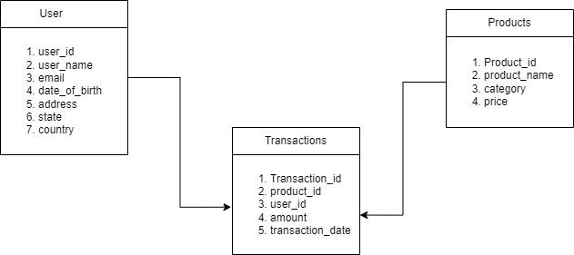

# Duckdb Analysis

The goal of this assignment is to study about the fnctionalities of duckdb and then explore where it shines.I created a very large fake dataset and perform data analysis using DuckDB, with a focus on optimizing the query execution time for aggregated queries and visalizing them. Add a new product with no history to the database and then find a way to forecast sales of that new product

## Dataset Description

The dataset was generated using the Faker library in Python and consists of three tables: transactions, users, and products. The transaction table contains 100 million rows with 6 attributes, the users table contains 10 million rows with 7 attributes , and the products table contains 200,000 rows with 4 attributes. The dataset was structured with the transaction table as the aggregation table and users and products as dimension tables.
You can find the final parqet file in this link: [fake_data_parquet](https://uofwaterloo-my.sharepoint.com/:f:/r/personal/s36sivar_uwaterloo_ca/Documents/fake_data_transactions?csf=1&web=1&e=fq62cJ)

## Database Schema

## Analysis Roadmap

The analysis can be found on the file ./analysis_final.ipynb
The anaysis proceeds in the following way,
1. Installing and Setup of DuckDB
2. Data Loading
3. Basic Data Analysis
   - Data Cleaning
   - Checking for Null Values
   - Checking for Duplicates
4. Aggregate Queries
   - Total Revenue by Category
   - Users with the Highest Total Spending by Country
   - Average Transaction Amount per Day in a Given Time Frame
   - Top Selling Product Categories with Average Price per Category
   - Grouping Users by Age
5. Query Optimization
   - Indexing
   - Window Functions
6. Data Visualization
   - Bar Charts
   - Scatter Plots
   - Histograms
7. Forecast sales of a new product
   - Add a new product with no histoy
   - Find existing products that are similar to the new one 
   - Use the histor of those to predict the sales of this new product
   - Used ARIMA model to predict the value

## Key Findings

- The synthetic dataset resembled real-world data scenarios.
- Aggregate queries provided valuable insights into various metrics based on different attributes.
- Optimization techniques significantly improved query performance.
- used the history of similar prroducts to forecast the sales of the new one 
- ARIMA model proved to be reliable for time series analysis

## Execution

To execute the analysis, follow these steps:

1. Install DuckDB: [DuckDB Installation Guide](https://duckdb.org/docs/installation)
2. Clone this repository: `git clone https://github.com/iamhwkchn/analysis_dckdb.git`
3. Download the dataset from this link [data_parquet](https://uofwaterloo-my.sharepoint.com/:f:/r/personal/s36sivar_uwaterloo_ca/Documents/fake_data_transactions?csf=1&web=1&e=fq62cJ) an then place them in the folder /merged in the root folder or create your own dataset by runnig the files data_gen.py and merged_csv.py in the given order.(NOTE: if your pc is not able to handle the merging of csv files in one go, yo can try this batch processing method provide in the files in transaction_batch_processing) 
4. Install required Python packages: `pip install -r requirements.txt`
5. Run the analysis scripts: `python analysis_final.py`

Feel free to explore the code and modify the analysis as needed. For any questions or issues, please contact `s36sivar@uwaterloo.ca`.
